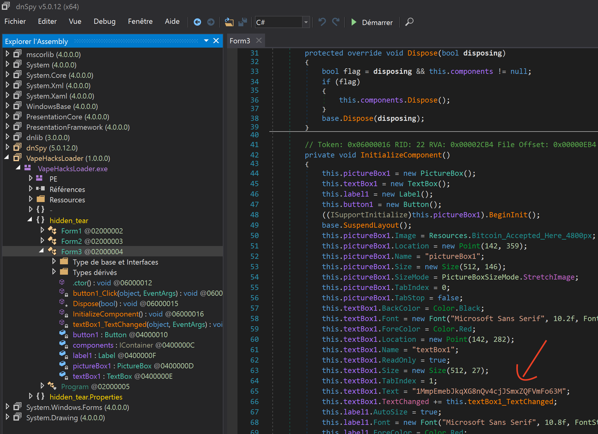
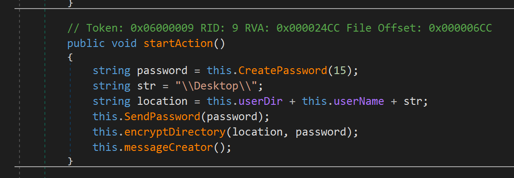
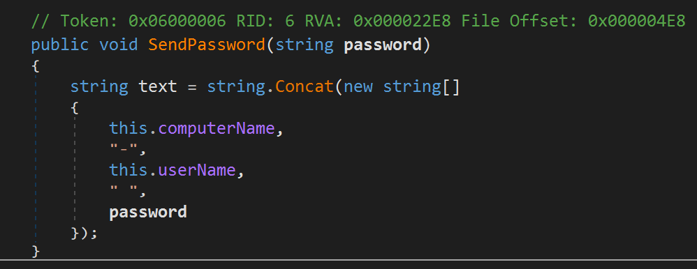
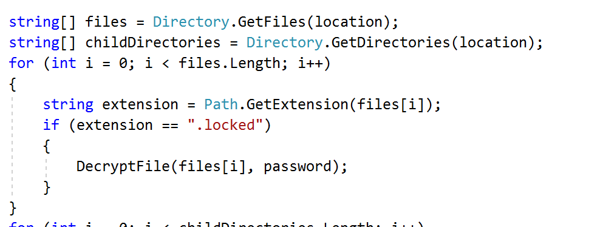
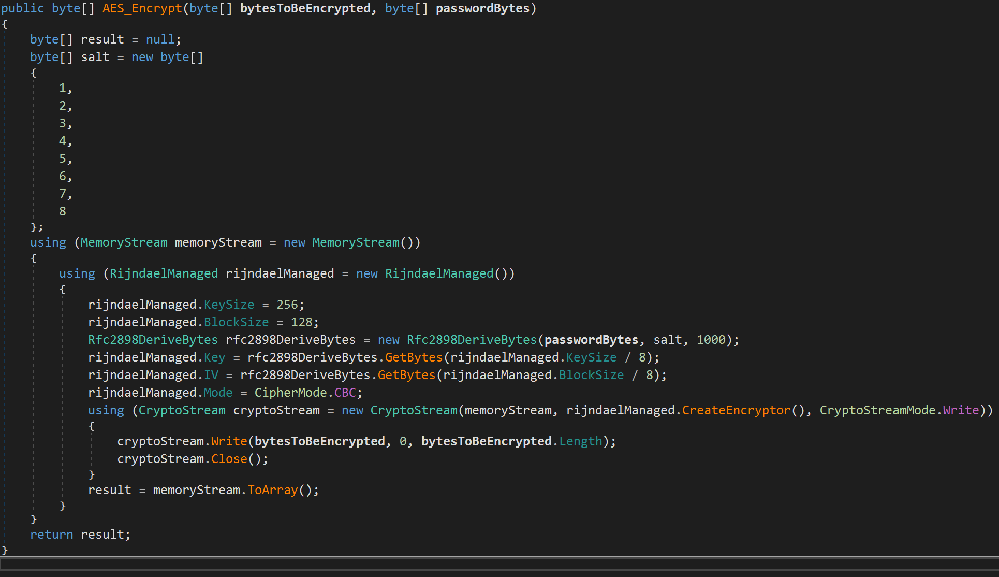
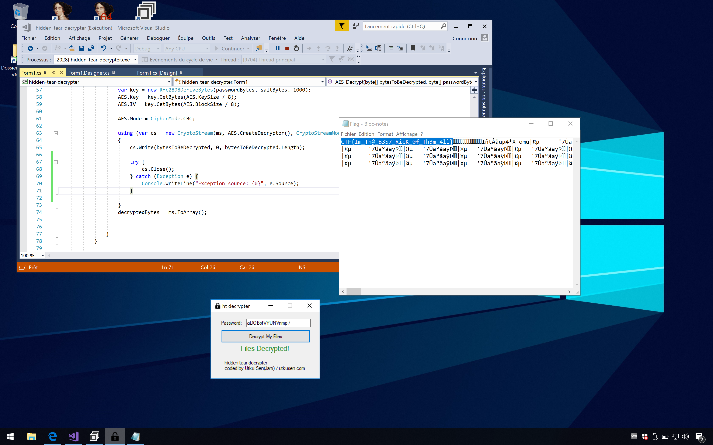

Il faut commencer par introduire le sujet et discuter un peu avec les
étudiants. Il est important de les faire parler pour voir où ils en sont et
sonder un peu le niveau de la salle.

**Les étudiants doivent avoir un Linux ou un macOS sous la main (si y'en
a qui se sentent de faire du Volatility sous Windows pourquoi pas mais
je m'y risquerai pas).**

**Les étudiants doivent avoir une machine virtuelle sous Windows disponible.
Les machines physiques sont à proscrire, il va y avoir de reverse de logiciel
malveillant.**


## Exercice 00

Volatility peut être installé via quelques packet managers (Aur, Brew)
mais une solution moins aléatoire est de récupérer toute l'archive du projet
et de lancer le `vol.py` manuellement.

[Guide à cette adresse...](https://github.com/volatilityfoundation/volatility/wiki/Installation)

Pour trouver le profil, on utilise la commande `imageinfo` qui nous donne :

* Win7SP1x64
* Win7SP0x64
* Win2008R2SP0x64
* Win2008R2SP1x64\_23418
* Win2008R2SP1x64
* Win7SP1x64\_23418

Le premier fera l'affaire. C'est le moment moment pour expliquer la structure
d'une commande Volatility. On met toujours le fichier sur lequel on travaille
et le profil. Puis on ajoute un verbe qui prend éventuellement des arguments.


## Exercice 01

Pour le nom de l'ordinateur, on peut passer par le registre. On commence
par utiliser la commande `hivelist` qui nous révèle
`\REGISTRY\MACHINE\SYSTEM`.

```
vol.py -f OtterCTF.vmem --profile=Win7SP1x64 hivelist

Volatility Foundation Volatility Framework 2.6
Virtual            Physical           Name
------------------ ------------------ ----
[...]
0xfffff8a000024010 0x000000002d50c010 \REGISTRY\MACHINE\SYSTEM
[...]
```

On peut par la suite aller chercher le clé qui nous intéresse dans cette *hive* avec
la commande `printkey` :

```
vol.py -f OtterCTF.vmem --profile=Win7SP1x64 printkey -o 0xfffff8a000024010 -K 'ControlSet001\Control\ComputerName\ComputerName'

Volatility Foundation Volatility Framework 2.6
Legend: (S) = Stable   (V) = Volatile

----------------------------
Registry: \REGISTRY\MACHINE\SYSTEM
Key name: ComputerName (S)
Last updated: 2018-06-02 19:23:00 UTC+0000

Subkeys:

Values:
REG_SZ                        : (S) mnmsrvc
REG_SZ        ComputerName    : (S) WIN-LO6FAF3DTFE
```

L'offset est celui en RAM et non celui sur le disque. Il faut alors expliquer
aux étudiants que le registre est une mine d'or dans le cadre d'une
investigation sur un poste Windows. La notion de ruche/clé peut aussi être
détaillée.

Pour le mot de passe, on commence par vérifier que les ruches `SYSTEM` et
`SAM` sont bien présentes. On peut parler rapidement du SAM ici.

On utilise ensuite la commande `hashdump` pour récupérer les NTLM des
utilisateurs présents sur la machine :

```
vol.py -f OtterCTF.vmem --profile=Win7SP1x64 hashdump -y 0xfffff8a000024010 -s 0xfffff8a0016d4010

Volatility Foundation Volatility Framework 2.6
Administrator:500:aad3b435b51404eeaad3b435b51404ee:31d6cfe0d16ae931b73c59d7e0c089c0:::
Guest:501:aad3b435b51404eeaad3b435b51404ee:31d6cfe0d16ae931b73c59d7e0c089c0:::
Rick:1000:aad3b435b51404eeaad3b435b51404ee:518172d012f97d3a8fcc089615283940:::
```

Le paramètre `-y` prend l'offset RAM de la clé `SYSTEM` tandis que `-s` prend
celui de `SAM`. On repère l'utilisateur Rick. On en profite pour parler un peu
du format de hash NTLM (faire une analogie avec le `/etc/passwd`).

Si on soumet ce hash sur des services en ligne, aucun password n'est remonté.
Il va falloir trouver autre chose.

**L'installation du plugin ci-dessous pose problème sous macOS si Volatility a
été installé via Brew. Le répertoire dans lequel le plugin va chercher ses
dépendances Python n'est alors pas le bon.**

**En cas de problème de nom sur `construct`, installer la version
`construct==2.5.5-reupload` du module.**

Le plugin `mimikatz` (fondé sur les recherches ayant permi de réaliser le
projet du même nom qui vaut le coup d'être introduit) permet d'aller pêcher le
mot de passe en clair :

```
vol.py -f OtterCTF.vmem --profile=Win7SP1x64 mimikatz

Module   User             Domain           Password
-------- ---------------- ---------------- ----------------------------------------
wdigest  Rick             WIN-LO6FAF3DTFE  MortyIsReallyAnOtter
wdigest  WIN-LO6FAF3DTFE$ WORKGROUP
```

On peut préciser que cette situation est assez rare en CTF et que les hash
sont souvent disponibles sur des outils comme [HashKiller](https://hashkiller.co.uk/)
ou [CrackStation](https://crackstation.net/).


## Exercice 02

Rien de particulier, verbe `netscan` :

```
vol.py -f OtterCTF.vmem --profile=Win7SP1x64 netscan
```

On a `192.168.202.131` qui revient à tout va.


## Exercice 03

Le malware n'a alors pas de connexion ouverte avec l'extérieur. C'est quelque
chose qu'il faut vérifier et c'est souvent un moyen d'identifier un logiciel
malveillant mais pas le seul.


## Exercice 04

Avec `pstree` :

```
Name                                                  Pid   PPid   Thds   Hnds Time
-------------------------------------------------- ------ ------ ------ ------ ----
 0xfffffa801b27e060:explorer.exe                     2728   2696     33    854 2018-08-04 19:27:04 UTC+0000
. 0xfffffa801b486b30:Rick And Morty                  3820   2728      4    185 2018-08-04 19:32:55 UTC+0000
.. 0xfffffa801a4c5b30:vmware-tray.ex                 3720   3820      8    147 2018-08-04 19:33:02 UTC+0000
. 0xfffffa801b2f02e0:WebCompanion.e                  2844   2728      0 ------ 2018-08-04 19:27:07 UTC+0000
. 0xfffffa801a4e3870:chrome.exe                      4076   2728     44   1160 2018-08-04 19:29:30 UTC+0000
.. 0xfffffa801a4eab30:chrome.exe                     4084   4076      8     86 2018-08-04 19:29:30 UTC+0000
.. 0xfffffa801a5ef1f0:chrome.exe                     1796   4076     15    170 2018-08-04 19:33:41 UTC+0000
.. 0xfffffa801aa00a90:chrome.exe                     3924   4076     16    228 2018-08-04 19:29:51 UTC+0000
.. 0xfffffa801a635240:chrome.exe                     3648   4076     16    207 2018-08-04 19:33:38 UTC+0000
```

On repère tout de suite `vmware-tray.ex(e)`, fils de `Rick And Morty`. Un envoi
à [VirusTotal](https://www.virustotal.com/fr/file/4f1fb587b070aeacf857afaf04ca6d37d438efeec15b672a0981ce9c2bf89d2d/analysis/)
confirme que ce processus n'est pas net.

Pour dumper le processus, verbe `procdump` :

```
vol.py -f OtterCTF.vmem --profile=Win7SP1x64 procdump -D . -p 3720

Volatility Foundation Volatility Framework 2.6
Process(V)         ImageBase          Name                 Result
------------------ ------------------ -------------------- ------
0xfffffa801a4c5b30 0x0000000000ec0000 vmware-tray.ex       OK: executable.3720.exe
```

Et pour le mapping mémoire, verbe `memdump` :

```
vol.py -f OtterCTF.vmem --profile=Win7SP1x64 memdump -D . -p 3720

Volatility Foundation Volatility Framework 2.6
************************************************************************
Writing vmware-tray.ex [  3720] to 3720.dmp
```

Il faut bien insister sur le fait que l'empreinte mémoire du processus est
tout aussi intéressante que le processus en lui même. On peut récupérer
très facilement des clés en clair, des adresses de paiement, des noms de
domaine, des URL de C&C, ect.


## Exercice 05

```
strings executable.3720.exe | ag ransom

This is Ransomware. It locks your files until you pay for them. Before you ask, Yes we will
```

C'est gagné, c'est bingo ! On est sur du ransomware.

```
strings executable.3720.exe | ag loader

VapeHacksLoader.exe
VapeHacksLoader
Loader
Loader-Private
C:\Users\Tyler\Desktop\hidden-tear-master\hidden-tear\hidden-tear\obj\Debug\VapeHacksLoader.pdb
```

On trigger sur `VapeHacksLoader`. Une recherche Google nous ammène sur $
ucyLocker. Je connais pas le malware mais on dirait du commercial, surement un
ransomware clé en main.

La dernière chaîne affichée passe par ce qui semble être un dépot versionné (en
raison du suffixe `-master`). Une recherche Google sur `hidden-tear-master`
nous renvoie sur [ce dépot GitHub](https://github.com/goliate/hidden-tear).
C'est un ransomware libre avec lequel on peut jouer un peu. C'est surement ça
qui a été utilisé pour construire l'épreuve.


## Exercice 06

```
file executable.3720.exe

executable.3720.exe: PE32 executable (GUI) Intel 80386 Mono/.Net assembly, for MS Windows
```

On est sur du .NET donc on va pouvoir sortir l'excellent
[dnSpy](`https://github.com/0xd4d/dnSpy`). J'en avais déjà
[parlé ici](writeup/reverse/2018/04/01/sostealthy) en cas de question.


On se balade un peu dans le projet, on finit par tomber sur le `Form3` de
`hidden_tear` qui dans son `InitializeComponent` nous donne :
`1MmpEmebJkqXG8nQv4cjJSmxZQFVmFo63M`.



Les adresses Bitcoin sont faciles à repérer car elles ont un format connu :

* P2PKH qui commence par le nombre 1, comme `1BvBMSEYstWetqTFn5Au4m4GFg7xJaNVN2`
* P2SH qui commence par le nombre 3, comme `3J98t1WpEZ73CNmQviecrnyiWrnqRhWNLy`
* Bech32 qui commence par bc1, comme `bc1qar0srrr7xfkvy5l643lydnw9re59gtzzwf5mdq`

Plus d'infos [sur cette page](https://en.bitcoin.it/wiki/Address).

Ou bien, histoire de flex un peu :

```
strings -el executable.3720.exe | ag "[13][a-km-zA-HJ-NP-Z1-9]{25,33}"

1MmpEmebJkqXG8nQv4cjJSmxZQFVmFo63M
```

On a besoin d'indiquer à `strings` que l'encodage (`-e`) des chaînes est en
UTF-16 (`-l`). C'est le default en .NET. Pour les étudiants qui le savent,
tant mieux. Pour ceux qui ne le savent pas encore, on peut leur en parler
maintenant mais je mets un indice plus tard lié à ça quand ça devient
indispensable.

L'expression régulière qu'on passe à `ag` vient de [cette rêgle Yara](https://github.com/JusticeRage/Manalyze/blob/master/bin/yara_rules/bitcoin.yara).

On peut en profiter pour faire une petite démo Yara ! On part de la rêgle de
Didier Stevens, on se rajoute le mot clé `wide` pour indiquer que les
caractères sont sur deux octets (toujours à cause de l'UTF-16) et ça passe :

```
vol.py -f OtterCTF.vmem --profile=Win7SP1x64 yarascan --yara-file=bitcoin.yara --pid=3720

Volatility Foundation Volatility Framework 2.6
Rule: BitcoinAddress
Owner: Process vmware-tray.ex Pid 3720
0x00ec51d6  31 00 4d 00 6d 00 70 00 45 00 6d 00 65 00 62 00   1.M.m.p.E.m.e.b.
0x00ec51e6  4a 00 6b 00 71 00 58 00 47 00 38 00 6e 00 51 00   J.k.q.X.G.8.n.Q.
0x00ec51f6  76 00 34 00 63 00 6a 00 4a 00 53 00 6d 00 78 00   v.4.c.j.J.S.m.x.
0x00ec5206  5a 00 51 00 46 00 56 00 6d 00 46 00 6f 00 36 00   Z.Q.F.V.m.F.o.6.
0x00ec5216  33 00 4d 00 00 3f 53 00 65 00 6e 00 64 00 20 00   3.M..?S.e.n.d...
0x00ec5226  30 00 2e 00 31 00 36 00 20 00 74 00 6f 00 20 00   0...1.6...t.o...
0x00ec5236  74 00 68 00 65 00 20 00 61 00 64 00 64 00 72 00   t.h.e...a.d.d.r.
0x00ec5246  65 00 73 00 73 00 20 00 62 00 65 00 6c 00 6f 00   e.s.s...b.e.l.o.
0x00ec5256  77 00 2e 00 00 45 49 00 20 00 70 00 61 00 69 00   w....EI...p.a.i.
0x00ec5266  64 00 2c 00 20 00 4e 00 6f 00 77 00 20 00 67 00   d.,...N.o.w...g.
0x00ec5276  69 00 76 00 65 00 20 00 6d 00 65 00 20 00 62 00   i.v.e...m.e...b.
0x00ec5286  61 00 63 00 6b 00 20 00 6d 00 79 00 20 00 66 00   a.c.k...m.y...f.
0x00ec5296  69 00 6c 00 65 00 73 00 2e 00 00 0b 46 00 6f 00   i.l.e.s.....F.o.
0x00ec52a6  72 00 6d 00 33 00 00 41 68 00 69 00 64 00 64 00   r.m.3..Ah.i.d.d.
0x00ec52b6  65 00 6e 00 5f 00 74 00 65 00 61 00 72 00 2e 00   e.n._.t.e.a.r...
0x00ec52c6  50 00 72 00 6f 00 70 00 65 00 72 00 74 00 69 00   P.r.o.p.e.r.t.i.
```

La rêgle :

```
rule BitcoinAddress {
  meta:
      description = "Contains a valid Bitcoin address, UTF-16 encoded"
      author = "Didier Stevens (@DidierStevens), edited by Geographer"
  strings:
      $btc = /\b[13][a-km-zA-HJ-NP-Z1-9]{25,33}\b/ wide
  condition:
      any of them
}
```


## Exercice 07

Le malware s'est installé en trois étapes :

* Un fichier torrent a été téléchargé depuis Chrome
* Rick a ouvert le torrent et récupéré son soit disant épisode de Rick &
  Morty
* Rick a double-cliqué sur l'exécutable qui se faisait passer pour une vidéo,
  cet exécutable drop le malware qui a chiffré son disque

En réalité, je n'ai pas vérifié si `Rick & Morty` était vraiment un dropper
mais à vu de nez...

A partir du moment où l'étudiant met tout ça dans le bon ordre, c'est correct.

Autrement, les flags attendus sont obtenus ainsi...

On sait que du Bittorent tourne donc il doit bien y avoir du fichier `.torrent`
quelque part sur la machine :

```
vol.py -f OtterCTF.vmem --profile=Win7SP1x64 filescan | ag "\.torrent"

Volatility Foundation Volatility Framework 2.6
0x000000007d8813c0      2      0 RW-rwd \Device\HarddiskVolume1\Users\Rick\Downloads\Rick And Morty season 1 download.exe.torrent
0x000000007dae9350      2      0 RWD--- \Device\HarddiskVolume1\Users\Rick\AppData\Roaming\BitTorrent\Rick And Morty season 1 download.exe.1.torrent
0x000000007dcbf6f0      2      0 RW-rwd \Device\HarddiskVolume1\Users\Rick\AppData\Roaming\BitTorrent\Rick And Morty season 1 download.exe.1.torrent
```

**A partir de là, on va commencer à abuser de `grep`. Même si ça peut sembler
assez bourrin, ça permet de plier rapidement pas mal d'épreuves en CTF...
Il peut être intéressant de présenter quelques outils CLI améliorés tels
que :**

* **[fd](https://github.com/sharkdp/fd) qui vient remplacer `find`**
* **[ag](https://github.com/ggreer/the_silver_searcher) qui vient remplacer `grep`**
* **[exa](https://github.com/ogham/exa) qui vient remplacer `ls`**

On teste les fichiers dans l'ordre. Le 'bon' est le deuxième. On se le dump :

```
vol.py -f OtterCTF.vmem --profile=Win7SP1x64 dumpfiles -Q 0x000000007dae9350 -D .

Volatility Foundation Volatility Framework 2.6
DataSectionObject 0x7dae9350   None   \Device\HarddiskVolume1\Users\Rick\AppData\Roaming\BitTorrent\Rick And Morty season 1 download.exe.1.torrent
```

Chaîne de caractères :

```
strings file.None.0xfffffa801b42c9e0.dat

d8:announce44:udp://tracker.openbittorrent.com:80/announce13:announce-listll44:udp://tracker.openbittorrent.com:80/announceel42:udp://tracker.opentrackr.org:1337/announceee10:created by17:BitTorrent/7.10.313:creation datei1533150595e8:encoding5:UTF-84:infod6:lengthi456670e4:name36:Rick And Morty season 1 download.exe12:piece lengthi16384e6:pieces560:\I
!PC<^X
B.k\_Rk
0<;O87o
!4^"
3hq,
&iW1|
K68:o
w~Q~YT
$$o9p
bwF:u
e7:website19:M3an_T0rren7_4_R!cke
```

On repère `M3an_T0rren7_4_R!cke`.

Comment est arrivé ce fichier torrent sur la machine ? Via Chrome ?

```
vol.py -f OtterCTF.vmem --profile=Win7SP1x64 pstree | ag chrome

Volatility Foundation Volatility Framework 2.6
. 0xfffffa801a4e3870:chrome.exe                      4076   2728     44   1160 2018-08-04 19:29:30 UTC+0000
.. 0xfffffa801a4eab30:chrome.exe                     4084   4076      8     86 2018-08-04 19:29:30 UTC+0000
.. 0xfffffa801a5ef1f0:chrome.exe                     1796   4076     15    170 2018-08-04 19:33:41 UTC+0000
.. 0xfffffa801aa00a90:chrome.exe                     3924   4076     16    228 2018-08-04 19:29:51 UTC+0000
.. 0xfffffa801a635240:chrome.exe                     3648   4076     16    207 2018-08-04 19:33:38 UTC+0000
.. 0xfffffa801a502b30:chrome.exe                      576   4076      2     58 2018-08-04 19:29:31 UTC+0000
.. 0xfffffa801a4f7b30:chrome.exe                     1808   4076     13    229 2018-08-04 19:29:32 UTC+0000
.. 0xfffffa801a7f98f0:chrome.exe                     2748   4076     15    181 2018-08-04 19:31:15 UTC+0000
```

On se récupère tous les PIDs et on se fait un petit script fish :

```
#! /usr/bin/env fish

# All the Chrome processes
set -l pids \
  4076 \
  4084 \
  1796 \
  3924 \
  3648 \
   576 \
  1808 \
  2748 \

# Create target directory if it does not exist
mkdir -p chrome_dumps

# Iterate over the PIDs and dump the memory mapping of each process
for pid in $pids
  vol.py -f OtterCTF.vmem --profile=Win7SP1x64 memdump -D chrome_dumps/ -p $pid &
end
```

Ce script peut être proposé aux étudiants. Il prend un truc comme 40 secondes
à être codé en live et il montre le temps qu'on peut gagner en maitrisant
un peu son shell. Le trick du `&` est sympa aussi : on lance en fait le
processus en arrière plan. De ce fait, on peut tout de suite démarrer un
nouveau processus et paralléliser le travail. Les processus en arrière plan
peuvent être surveillés avec la commande `fg`.

Tout roule :

```
./chrome_dump_script.fish

Volatility Foundation Volatility Framework 2.6
************************************************************************
Writing chrome.exe [  4076] to 4076.dmp
Volatility Foundation Volatility Framework 2.6
************************************************************************
Writing chrome.exe [  4084] to 4084.dmp
Volatility Foundation Volatility Framework 2.6
************************************************************************
[...]
```

Recherche de fichier torrent dans tous les dumps :

```
strings chrome_dumps/* | ag "\.torrent"

[...]
Rick And Morty season 1 download.exe.torrent
[...]
Download complete: Rick And Morty season 1 download.exe.torrent. Press Shift+F6 to cycle to the downloads bar area.
[...]
```

Au moins maintenant on est sûr que ça vient bien de Chrome...

Pour choper le flag, on peut forcer sur `grep` et élargir un peu la recherche
aux chaînes adjacentes :

```
strings chrome_dumps/* | ag -B10 -A10 "\.torrent"

[...]
display:inline;width:56px;height:200px;m>
Hum@n_I5_Th3_Weak3s7_Link_In_Th3_Ch@inYear
//sec-s.uicdn.com/nav-cdn/home/preloader.gif
simple-icon_toolbar-change-view-horizontal
 nnx-track-sec-click-communication-inboxic.com
nx-track-sec-click-dashboard-hide_smileyable
Nftd-box stem-north big fullsize js-focusable
js-box-flex need-overlay js-componentone
Jhttps://search.mail.com/web [q origin ]Year
ntrack-and-trace__delivery-info--has-iconf
Rick And Morty season 1 download.exe.torrent
tbl_1533411035475_7.0.1.40728_2033115181
panel-mail-display-table-mail-default35"
Cnpanel-mail-display-table-mail-horizontal.js
trc_rbox text-links-a trc-content-sponsored
identity_OjpwcmVsb2FkZXIuaHRtbC50d2ln
Move the widget to its desired position.3c8=
Set-Cookie, no-store, proxy-revalidateHxRKw=
Set-Cookie, no-store, proxy-revalidate143/
tbl_1533411035475_7.0.9.40728_2033115181
"mail.com Update" <service@corp.mail.com>
[...]
```

Mémotechnique à filer aux étudiants : `-B`/`-A` pour **B**efore et **A**fter.

On repère `Hum@n_I5_Th3_Weak3s7_Link_In_Th3_Ch@inYear`.


## Exercice 08

On continue le reverse à coup de `dnSpy`, tout est en clair donc juste en se
baladant un peu on tombe sur une routine intéressante :



La fonction `CreatePassword` génère une chaine de caractère aléatoire.
C'est le mot de passe que l'on recherche. Le mot de passe généré est ensuite
passé à la fonction `SendPassword` qui a le corps suivant :



On peut raisonnablement espérer que la valeur de retour de cette fonction
se trouve dans notre dump de la mémoire du processus. On peut `grep` assez
facilement étant donné que l'on connait le nom de la machine ainsi que le
nom de l'utilisateur courant :

```
strings -el 3720.dmp  | ag "WIN-LO6FAF3DTFE-Rick"

WIN-LO6FAF3DTFE-Rick aDOBofVYUNVnmp7
```

Notre mot de passe est donc `aDOBofVYUNVnmp7`.


## Exercice 09

L'objectif de cet exercice est de mettre en relation tous les éléments
précédents afin de se faire un outil pour déchiffrer les fichiers.

Le fichier à déchiffrer se trouve sur le bureau. Je l'ai pas vraiment
cherché, je me suis dit qu'il serait là, c'est assez commun pour
ce genre d'épreuve :

```
vol.py -f OtterCTF.vmem --profile=Win7SP1x64 filescan | ag "desktop"

[...]
0x000000007e1b42d0      1      0 R--rwd \Device\HarddiskVolume1\Users\Rick\AppData\Roaming\Microsoft\Windows\Libraries\desktop.ini
0x000000007e410890     16      0 R--r-- \Device\HarddiskVolume1\Users\Rick\Desktop\Flag.txt
0x000000007e416320      1      0 R--rwd \Device\HarddiskVolume1\Program Files\desktop.ini
[...]
```

Le nom `Flag.txt` est assez évoquateur... On se le dump :

```
vol.py -f OtterCTF.vmem --profile=Win7SP1x64 dumpfiles -Q 0x000000007e410890 -D .

Volatility Foundation Volatility Framework 2.6
DataSectionObject 0x7e410890   None   \Device\HarddiskVolume1\Users\Rick\Desktop\Flag.txt
```

En regardant un peu le code de `hidden-tear`, on voit que c'est de l'AES. Il
y a un programme de déchiffrement dans le dépot donc on se le récupère.
La fonction intéressante est `AES_Decrypt` :

```cs
public byte[] AES_Decrypt(byte[] bytesToBeDecrypted, byte[] passwordBytes) {
  byte[] decryptedBytes = null;

  // Set your salt here, change it to meet your flavor
  // The salt bytes must be at least 8 bytes
  byte[] saltBytes = new byte[] { 1, 2, 3, 4, 5, 6, 7, 8 };

  using (MemoryStream ms = new MemoryStream()) {
    using (RijndaelManaged AES = new RijndaelManaged()) {
      AES.KeySize = 256;
      AES.BlockSize = 128;

      var key = new Rfc2898DeriveBytes(passwordBytes, saltBytes, 1000);
      AES.Key = key.GetBytes(AES.KeySize / 8);
      AES.IV = key.GetBytes(AES.BlockSize / 8);

      AES.Mode = CipherMode.CBC;

      using (var cs = new CryptoStream(ms, AES.CreateDecryptor(), CryptoStreamMode.Write)) {
        cs.Write(bytesToBeDecrypted, 0, bytesToBeDecrypted.Length);

        try {
          cs.Close();
        } catch (Exception e) {
          Console.WriteLine("Exception source: {0}", e.Source);
        }
      }

      decryptedBytes = ms.ToArray();
    }
  }

  return decryptedBytes;
}
```

La ligne du `cs.Close()` me levait une exception donc j'ai dû la mettre
dans un `try`/`catch`.

J'ai aussi renommé le fichier dumpé en `Flag.txt.locked`. Le programme de
déchiffrement ne passe que sur les fichiers avec cette extension :



On peut valider dans dnSpy que l'utilisateur du ransomware n'a pas
modifié de paramêtre lors du chiffrement :



On peut comparer avec le dépot du projet, c'est bien la fonction
originale. Il faut insister sur ces vérifications qui peuvent donner
l'impression qu'on est complêtement à côté de la solution alors qu'on
a juste oublié de récupérer une valeur de salt différente, par exemple.

Tout roule :



Et on obtient le flag final : `CTF{Im_Th@_B3S7_RicK_0f_Th3m_4ll}`.


## Exercice 10

Il faut insister pour les étudiants nous fassent un petit retour...
