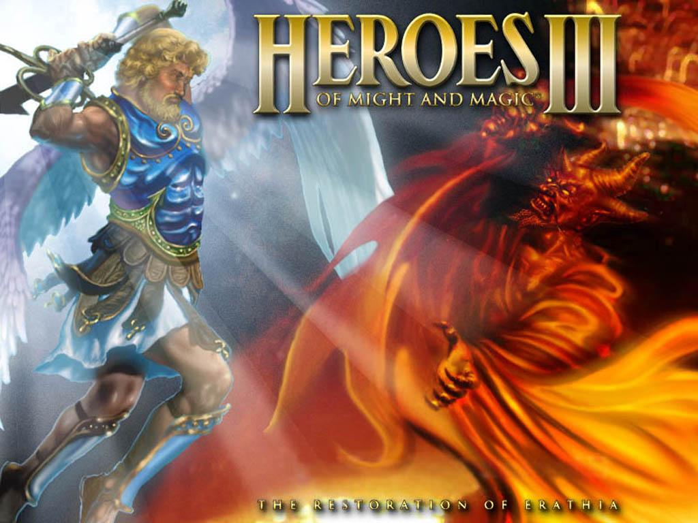

Après la [journée d'introduction](reverse-00-student.html) au
reverse, nous pouvons commencer à tâter des binaires un peu plus imposants et
qui n'ont pas pour seul objectif de vous exposer une routine de vérification.

N'hésitez pas à passer plus de temps sur les exercices de la journée
précédente. Une fois ces bases maitrisées, vous êtes autonomes dans le
milieu du reverse. C'est désormais à vous d'aller chercher de la documentation
plus spécifique, de vous renseigner sur de nouvelles techniques, etc.

Même si c'est pas toujours super légal, vous pouvez vous attaquer à des
binaires commerciaux (logiciels, jeux vidéos...), ils embarquent souvent des
mécanismes de protections intéressants à reverse. Il y a parfois de grosses
surprises mais la logique est certainement la suivante : plus la date de
commercialisation est ancienne, plus les protections seront faciles à reverse.

**Note : reverse du binaire commercial, c'est cool, et je suis le premier à
aimer ça. Tant qu'on le fait dans son coin, j'imagine qu'on ne fait de mal à
personne. Mais mettre en ligne une release pirate sur un tracker, c'est moins
cool. Si vous lisez cette page, c'est surement que vous bossez dans l'info.
Vous savez donc que les logiciels prennent un temps fou à être écrits,
édités... Et que les développeurs ont aussi besoin de manger à la fin du
mois. 🍗**


## Exercice 00

Nous allons justement nous attaquer à un vieux jeu pour ordinateur: *Heroes of
Might and Magic III*. Il est disponible sous Windows, macOS, Linux... Vous
n'avez fait que du Linux dans cette série, jusqu'à maintenant. Il est
temps de voir un peu autre chose...

Tout ce que vous avez appris sur l'assembleur, les patterns de code, les
mécanismes liés au fonction, etc. Tout cela est toujours valable sous Windows.
Il existe de nombreuses autres spécificités mais vous êtes déjà opérationnel.

Le plus gros changement que vous aller tout de suite remarquer est le passage
de la LibC à l'API Win32. Vous avez surement déjà du voir des références à
`Kernel32.dll`, `User32.dll` ou même `GDI32.dll`. Ces trois fichiers sont plus
ou moins votre `libc.so` sous Windows. Ils permettent aux développeurs
d'accéder à un ensemble normalisé et standard (du moins, du point de vue de
Microsoft) de fonctions.

Beaucoup de fonctions sont les mêmes que sous Linux (`strcmp` ou `strlen` par
exemple) mais on a aussi de nombreuses exclusivités, comme la communication
avec des périphériques externes, de la manipulation de fenêtres ou des douceurs
telles que
[VirtualAllocEx](https://msdn.microsoft.com/en-us/library/windows/desktop/aa366890(v=vs.85).aspx).
Le MSDN sera votre documentation de référence pour cette API.

Grande nouvelle ! Vous êtes maintenant encouragés à utiliser IDA Pro ! GDB
c'est cool mais c'est un peu pour les enfants. Rentrez dans la cour des
grands, installez IDA et lachez des gros F5.

Installez IDA puis soyez attentif pendant la démonstration.


## Exercice 01

La licence *Heroes of Might and Magic* appartenait à l'origine à 3DO. Suite à
la fallite de cette entreprise, c'est Ubisoft qui la récupère. Le dernier (VII)
opus sorti date de 2015. La série est considérée comme morte depuis 2016,
Ubisoft ayant annoncé avoir rompu avec Limbic Entertainment, l'entreprise qui a
développé les opus VI et VII.

L'épisode III est souvent considéré comme le meilleur de la série. Beaucoup de
streamers y jouent régulièrement et il existe une solide communauté de joueurs
en ligne.

Il existe plusieurs releases de l'épisode III : le jeu simple, le jeu et une
ou plusieurs extensions, une *Complete Edition* avec toutes les extensions,
un version HD officielle, une version HD patchée officieusement, une version
GoG...

La version HD officielle est récente et présente des mécanismes de protections
solides. Nous n'allons pas nous y intéresser. La version HD patchée ainsi que
la version GoG sont toutes les deux dépourvues de protection donc nous
n'allons pas y toucher non plus. Nous allons nous concentrer sur la version
"originale" qui présente le même mécanisme de protection, peu importe le
nombre d'extensions avec laquelle elle est livrée.



Vous pouvez télécharger ici une [Complete Edition](https://cdn.geographer.fr/heroes_3.zip), qui correspond au jeu
originale, plus toutes ces extensions. La version physique de cette édition
se présentait sous la forme d'une boîte contenant 3 CDs :

* le jeu original, intitulé *Heroes of Might and Magic III: Restoration of
  Erathia*
* une première extension, *Armageddon's Blade*
* une deuxième extension, *Shadow of Death*

(Mine de rien, je vous donne des indices avec toutes ces infos... )

Vous devez faire en sorte de rendre le jeu "portable". Je dois être capable
de copier/coller le dossier de votre jeu sur mon ordinateur et profiter
de tout le contenu sans avoir à insérer un CD ou quoi que ce soit...

Pour vous aider, vous pouvez répondre aux questions suivantes :

* quel est le mécanisme de protection utilisé ?
* quelle(s) fonction(s) de l'API Win32 peuvent servir à implémenter cette
  protection ?
* parmi ces fonctions API, lesquelles sont utilisées dans le binaire ?
* une fonction du binaire doit attirer votre attention, quelles sont les
  valeurs que cette fonction peut renvoyer ?
* quelle est la valeur de retour qui nous arrange ?
* regardez ensuite la fonction appelante, comment garantir que la valeur
  de retour que nous venons d'évoquer ne sera jamais écrasée ?


## Exercice 02

*Cet exercice est une création de **caillou**, merci à lui !*

Pour récupérer l'épreuve :

```
docker pull cailloux/re-poc-php:latest
```

Pour l'exécuter, par exemple :

```
docker run -it --name challenge --rm cailloux/re-poc-php:latest

Entre quelque chose refre:
test
Tu ferais mieux d'arreter de faire de la merde
```

Mais rien ne vous empêche de sortir du container... Il s'agit simplement de
l'environnement de référence !

Votre objectif : trouver le bon mot de passe.

Indice : aucun, débrouillez vous ! :p


## Exercice 03

Comme d'habitude, merci de nous faire part de vos questions, remarques,
suggestions ou quoi que ce soit à l'adresse <lucas.santoni@epitech.eu>.

Merci encore à Caillou et Oursin pour leurs épreuves. Merci à Kijara pour ses
conseils et ses relectures.
