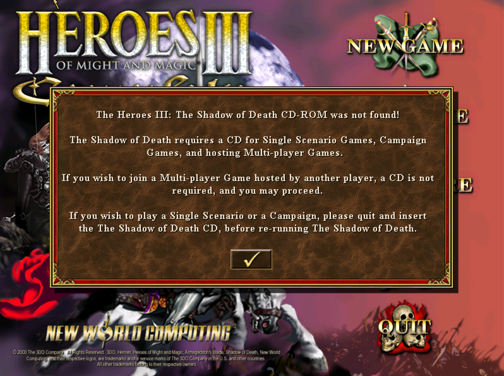
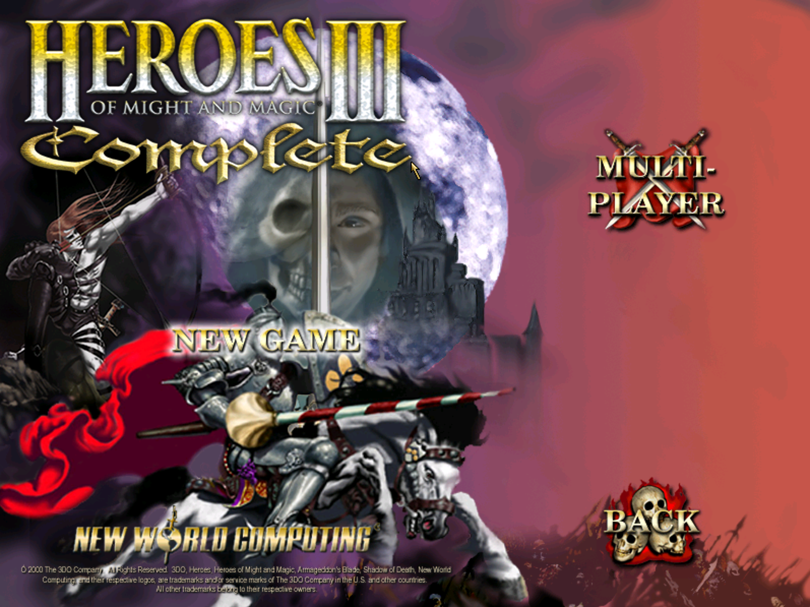
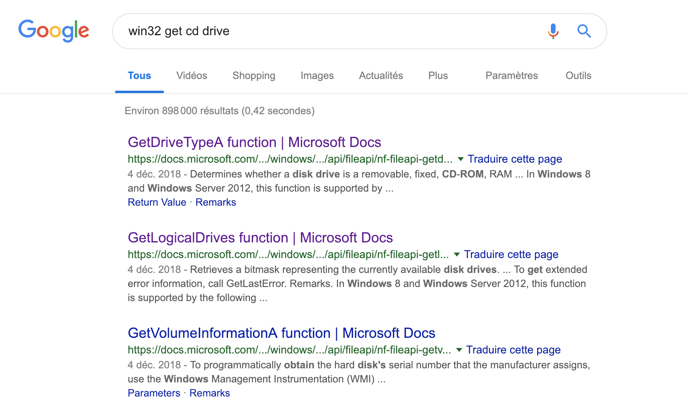
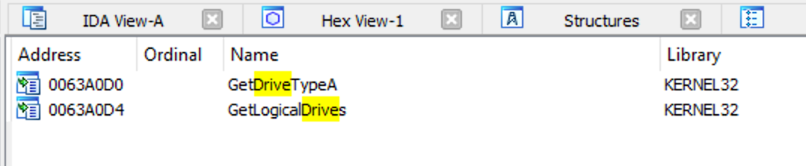
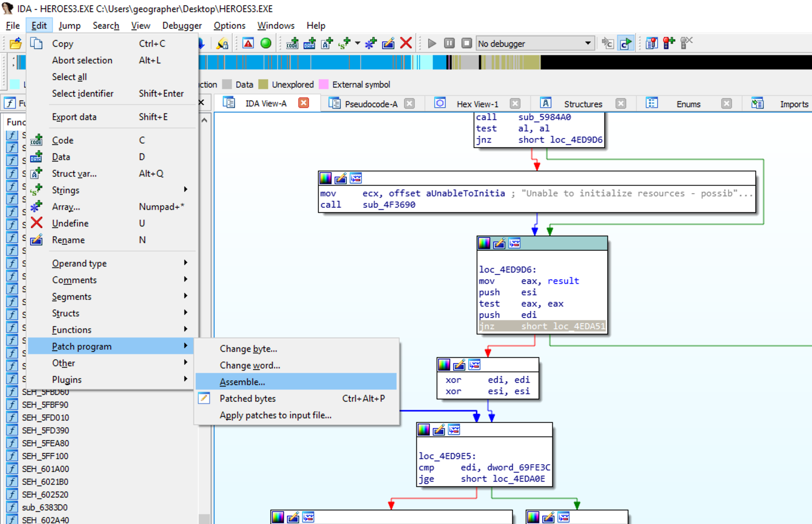
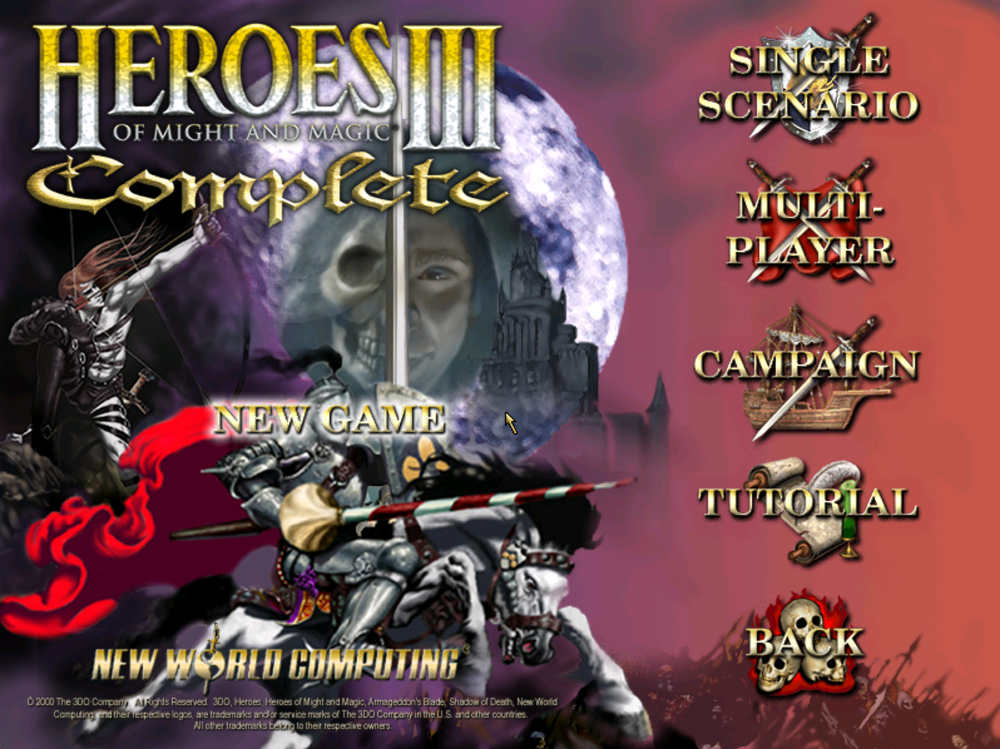

## Exercice 00

Il faut introduire un peu le monde de Windows. Quelques notions à évoquer :

* l'API Win32
* les DLLs
* le MSDN

Il faut insister sur le fait que les fonctions ont souvent des noms explicites,
que l'on peut deviner, ça aide. Aussi, le fait que l'API Win32 soit responsable
de beaucoup plus de choses que la LibC (périphériques surtout, c'est important
pour les étudiants étant donné que ça leur donne un indice sur par où commencer
pour la suite).

Si le public est chaud, pourquoi pas lancer des sujets comme le format PE
ou l'IAT. Attention, ce n'est pas utile pour le reste de la journée.

Pour la démo IDA, on montre :

* comment charger un binaire
* le système de base de données, pour ne pas se taper toute l'analyse à chaque
  ouverture
* les différentes vues : *listing*, *graph*, *decompiler*
* les *imports*, les *cross references*
* comment se balader, entrer dans une fonction, sortir
* renommer un nom, poser un commentaire
* changer la représentation d'une valeur
* comment patcher des morceaux de binaires et exporter le résultat
* on évoque le scripting Python pour les curieux


## Exercice 01

La première chose est de se faire un backup du binaire, on se doute qu'il va
y avoir du patching à faire.

On lance le binaire normalement, on nous fait comprendre qu'il va falloir
insérer un CD valide...



On peut jouer en ligne mais pas de contenu solo, le menu *NEW GAME* est vide :



On se doute que l'API Win32 propose des fonctions permettant de travailler
avec le lecteur CD.



La fonction
[GetLogicalDrives](https://docs.microsoft.com/en-us/windows/desktop/api/fileapi/nf-fileapi-getlogicaldrives)
permet de récupérer une représentation de tous les disques alors accessibles.
Puis [GetDriveTypeA](https://docs.microsoft.com/en-us/windows/desktop/api/fileapi/nf-fileapi-getdrivetypea)
nous permet de savoir si tel ou tel disque est bien un CD.

On peut charger le binaire dans IDA. L'analyse prend un peu de temps (~6k+
fonctions, on est sur un jeu quand même). On recherche ces deux fonctions
dans l'onglet des *imports* :



Les deux fonctions sont utilisées dans une même routine : `sub_50C1C0`.
`GetDriveTypeA` est également utilisée dans `__validdrive` mais cette dernière
fonction ne nous intéresse pas, malgré son nom aguicheur.

Regardons un peu le code de `sub_50C1C0` (que nous appelerons maintenant
`checkForCD`).

```c
signed int checkForCD()
{
  int v0; // eax
  signed int result; // eax
  DWORD v2; // esi
  char v3; // al
  const char *v4; // eax
  int v5; // edi
  _BYTE *v6; // ecx
  char v7; // al
  signed int v8; // ebx
  int v9; // eax
  bool v10; // sf
  unsigned __int8 v11; // of
  char v12; // [esp+20Ch] [ebp-3Ch]
  char v13; // [esp+20Dh] [ebp-3Bh]
  char v14; // [esp+225h] [ebp-23h]
  char v15; // [esp+228h] [ebp-20h]
  int v16; // [esp+22Ch] [ebp-1Ch]
  int v17; // [esp+238h] [ebp-10h]
  int v18; // [esp+23Ch] [ebp-Ch]
  int v19; // [esp+244h] [ebp-4h]

  strcpy((char *)&Text, aDataH3bitmapLo);
  v0 = _open(&Text, 0x8000);
  if ( v0 != -1 )
    goto LABEL_28;
  if ( _chdir((const char *)&Data) == -1 )
    return 3;
  v0 = _open(&Text, 0x8000);
  if ( v0 == -1 )
    return 4;
LABEL_28:
  _close(v0);
  v2 = GetLogicalDrives();
  if ( strlen((const char *)&byte_698838) == 0 )
    goto LABEL_29;
  byte_6839B8 = byte_698838;
  v3 = toupper((char)byte_698838) - 65;
  if ( !((1 << v3) & v2) )
    goto LABEL_29;
  RootPathName[0] = v3 + 65;
  if ( GetDriveTypeA(RootPathName) != 5 )
    goto LABEL_29;
  v4 = *(const char **)(sub_597D00(&v15) + 4);
  if ( !v4 )
    v4 = byte_63A608;
  v5 = _open(v4, 0x8000);
  if ( v16 )
  {
    v6 = (_BYTE *)(v16 - 1);
    v7 = *(_BYTE *)(v16 - 1);
    if ( v7 && v7 != -1 )
      *v6 = v7 - 1;
    else
      operator delete(v6);
  }
  if ( v5 != -1 )
  {
    _close(v5);
    result = 0;
  }
  else
  {
LABEL_29:
    v12 = 0;
    memset(&v13, 0, 0x18u);
    v14 = 0;
    v19 = 0;
    v8 = 2;
    do
    {
      if ( (1 << v8) & v2 )
      {
        RootPathName[0] = v8 + 65;
        if ( GetDriveTypeA(RootPathName) == 5 )
        {
          v9 = v19;
          *(&v12 + v19) = v8;
          v19 = v9 + 1;
        }
      }
      ++v8;
    }
    while ( v8 < 26 );
    v18 = 0;
    v17 = (char)v19;
    do
    {
      v19 = 0;
      Sleep(0xBB8u);
      v11 = __OFSUB__(v18 + 1, 2);
      v10 = v18++ - 1 < 0;
    }
    while ( v10 ^ v11 );
    result = 2;
  }
  return result;
  }
```

Je n'ai pas reverse toute la fonction mais en gros...

On commence par rechercher le fichier `DATA\H3BITMAP.LOD` (on ne parle pas
encore de CD, mais du répertoire courant) et on sort avec un code d'erreur
(`3` ou `4`) si on ne le trouve pas.

On a ensuite plusieurs conditions qui, lorsqu'elles sont vérifiées, nous
font sauter sur `LABEL_29`. Si on ne valide aucune condition, on finit par
obtenir `0` comme valeur de retour, ce qui ressemble à un succès.

Si on saute sur `LABEL_29`, on a alors d'autres vérifications qui sont
effectuées. Quoiqu'il arrive, on retourne alors `2`.

Bien que `0` semble clairement indiquer un succès, nous allons regarder la
fonction parente (celle qui appelle celle-ci) afin de donner un contexte à
ces valeurs :

```c
signed int sub_4ED650()
{
  [...]

  if ( !sub_4F0690() )
    return 1;
  dword_69957C = checkForCD();
  if ( !(unsigned __int8)sub_598210() )
    sub_4F3690(aUnableToInitia);
  if ( !(unsigned __int8)sub_5984A0() )
    sub_4F3690(aUnableToInitia);
  if ( !dword_69957C )
  {
    v3 = 0;
    v4 = 0;
    while ( v3 < dword_69FE3C )
    {
      if ( !_strcmpi((const char *)dword_69FE2C + v4, aH3x2Rne1Smk) )
        goto LABEL_84;
      ++v3;
      v4 += 44;
    }
    v5 = 0;
    for ( i = 0; ; i += 44 )
    {
      if ( v5 >= dword_69FE3C )
      {
        dword_69957C = 5;
        goto LABEL_84;
      }
      if ( !_strcmpi((const char *)dword_69FE2C + i, aH3abab1Smk) )
        break;
      ++v5;
    }
    dword_69957C = 6;
  }
LABEL_84:
  dword_694DA4 = (LPCRITICAL_SECTION)sub_55C720(aButtonWav);
  dword_699258 = 0;
  dword_69925C = 0;
  dword_6976D8 = -1;
  dword_6985BC = 0;
  *((_DWORD *)dword_6994E8 + 80286) = 0;
  strcpy((char *)dword_6994E8 + 128729, aTestH3m);
  *((_BYTE *)dword_6994E8 + 129089) = 0;
  memset(&dword_698998, 0, 0x28u);
  dword_698400 = 0;
  if ( dword_698A34 )
  {
    dword_6989E4 = LoadMenuA(hInstance, (LPCSTR)0x6F);
    v7 = LoadMenuA(hInstance, (LPCSTR)0x71);
  }
  else
  {
    dword_6989E4 = LoadMenuA(hInstance, (LPCSTR)0x6E);
    v7 = LoadMenuA(hInstance, (LPCSTR)0x70);
  }
  dword_6989E8 = v7;
  sub_45DEE0();
  dword_699580 = 1;
  return 1;
  }
```

J'ai coupé le début de la fonction. On est en fait dans une grosse routine
d'initialisation qui se charge de récupérer de la musique, de la vidéo,
des sprites... La plupart des opérations sont vitales et conduisent à une
sortie prématurée (`return` ou `sub_4F3690`) en cas d'échec.

On se concentre sur l'appel à `checkForCD`. On remarque que la valeur de
retour est stockée, on la renomme en `result`. Si la valeur de retour évalue
à false (`0`), on rentre dans un `if` qui va exécuter du code supplémentaire.

Ce `if` ne nous arrange pas vraiment étant donné qu'il peut venir écraser
la valeur de `result`. On pourrait étudier la logique de ce `if` pour éviter
de se faire écraser (on part du principe que `0` indique toujours un succès)
mais il est plus simple de carrément sauter tout ce code pour l'instant.

On va donc appliquer les patch suivant :

* on va remplacer le `call checkForCD` par un `mov eax, 0x0`, ainsi on
  s'assure un `result` de `0`
* on va remplacer le `jnz short loc_4EDA51` par un `jz loc_4EDA51`, `4EDA51`
  étant la position du code après le `if` que nous voulons éviter

Pour patcher dans IDA : `Edit > Patch program > Assemble...` :



Puis on exporte le binaire patché : `Edit > Patch program > Apply patches to input files`.
Les options par défaut sont bonnes, on touche rien.

On remet notre nouveau binaire dans le dossier du jeu, on le lance. Plus de
popup et le menu de jeu est rempli :



Pour ce qui est des différentes valeurs que peut prendre `result`, on
a en fait plusieurs cas :

* absence de certains fichiers locaux
* absence de CD
* CD du jeu original
* CD de la première extension...

D'où les différentes valeurs.


# Exercice 02

Je touche pas à ça !


## Exercice 03

On insiste pour avoir un retour ! Et on indique aux étudiants que s'ils
veulent continuer ils peuvent nous envoyer des questions par mail !
